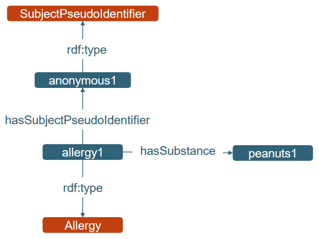

## Semantization overview

This folder includes the different files and scripts used for semantizing simulated data. 

If you'd like to take a look at the step by step reasoning and coding to semantize data, open `Semantization_test.ipynb` from `Jupyterlab` after creating a conda environment with `semantization.yaml` as follows:

```
conda env create -f semantization.yaml -n semantization
conda activate semantization
jupyter-lab
```

Then open `Semantization_test.ipynb` from the panel on the left side to run the code interactively.

To run the semantization process directly, use the following commands:

```
conda env create -f semantization.yaml -n semantization
conda activate semantization
conda run python semantization.py
```

After successfully semantizing the data, the extended ontology can be found in the `output` folder as `sphn_ontology_extended.ttl`.

### Detailed file descriptions

 - `Semantization_test.ipynb` is a python notebook providing a step by step guide on how the semantization process is built. It includes the addition of semantic relationships to the SPHN ontology, the breakdown of the patient `JSON` files to find the information needed and finally a general loop combining all of the previous steps to extend the SPHN ontology with our simulated patient data. For more details on the thought process, check the "Semantization details" section below.
 - `semantization.yaml` is a YAML file including all of the packages and tools needed to use and run all of the scripts in this folder. In practice, it should be used to create a `conda` environment with everything that's needed, ensuring reproducibility.
 - `sphn_ontology.ttl` is a Turtle file obtained from the [official SPHN GitLab](https://git.dcc.sib.swiss/sphn-semantic-framework/sphn-ontology) and includes the official SPHN ontology from 2022.
 - `sphn_ontology_extended.ttl` (in the `output` folder) is a Turtle file extending the SPHN ontology with information coming from our simulated patient data, specifically patient IDs and allergy information.
 - `test_patient.json` is a dummy patient `JSON` file used for data wrangling and getting familiar with the content and format of the file. It's used in `Semantization_test.ipynb`.
 
## Semantization details

To semantize data, the `rdflib` package has everything needed to carry out such a task. After playing around with the `R` version of the package, I noticed an important shortcoming that made me switch to the Python version. Long story short, the sematization process is not easy at all to implement programmatically. A good knowledge of the ontology is needed, together with semantization logic and also robust programming. In order to do things properly, I simplified the goal of the semantization by selecting a simple schema to be added (see picture below). More specifically, I wanted to add patient IDs, their allergy type and the substance(s) associated to this allergy type. This follows the example provided by the [SPHN Training material](https://git.dcc.sib.swiss/sphn-semantic-framework/sphn-training-material/-/tree/master/SPHN%20RDF%20and%20SPARQL%20primer#training-primer-rdf-and-sparql) which is a good reference point. 
To end this section, I'd like to highlight some important challenges to keep in mind when trying to transform data into a semantic format:

 - Be familiar with the data format and structure you're working with (in this case I worked with `json` files)
 - Familiarize yourself with the reference framework (in this case the SPHN one)
 - Make sure to generate semantic data with all of the relationships needed (define terms AND ALL of their connections)


